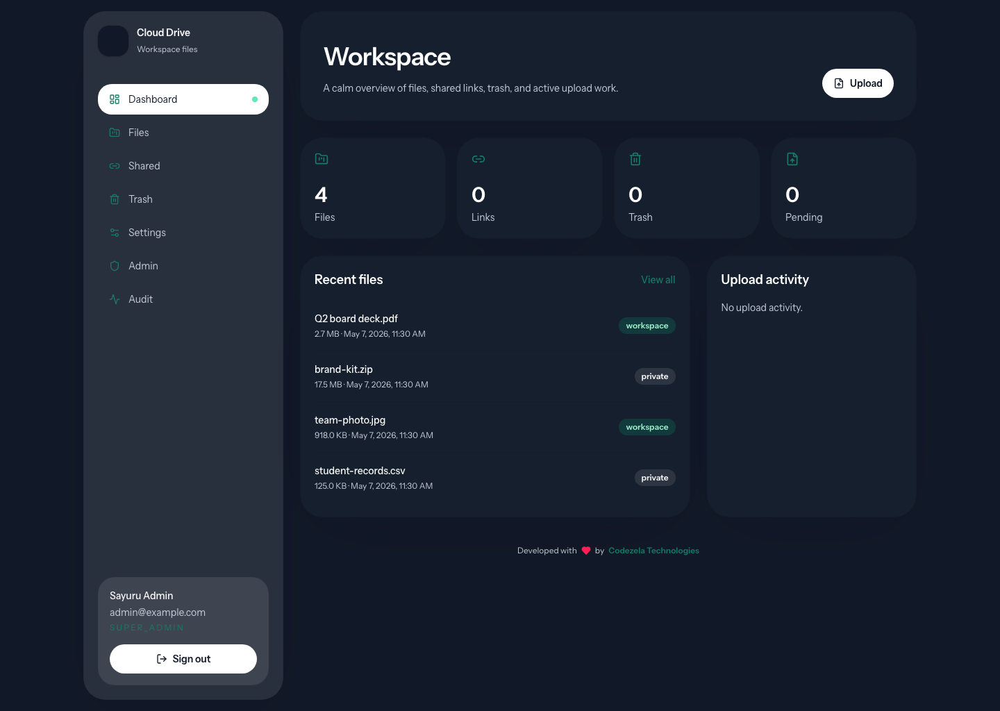
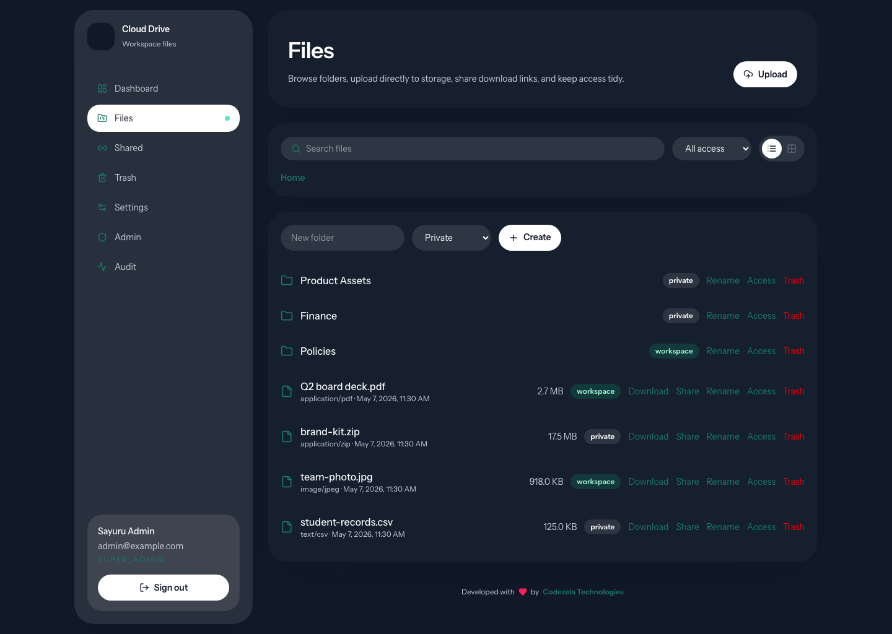
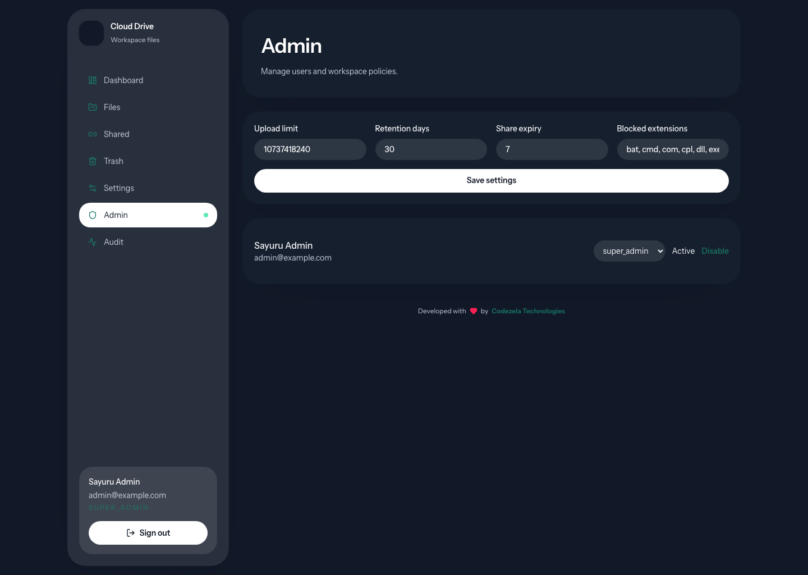

# Cloud Drive Laravel

A standalone Laravel 13 Cloud Drive application for private workspace file management. It uses Vue, Inertia, TypeScript, Tailwind CSS, and Backblaze B2 presigned URLs so file bytes move directly between the browser and object storage.

The app is intentionally focused on the core drive workflow: upload, browse, organize, share download links, recover deleted items, audit actions, and manage workspace policy.

## Screenshots

These desktop screenshots are captured from the real local Laravel app with the demo workspace seed.







## Stack

- Laravel 13.x, PHP 8.3+
- Vue 3, Inertia 3, TypeScript, Vite, Tailwind CSS 4
- shadcn-vue starter components and lucide-vue icons
- PostgreSQL for production metadata
- Backblaze B2 through the S3-compatible AWS SDK for PHP
- Fortify authentication with profile, password, two-factor, and browser-session screens
- Pest, Laravel Pint, ESLint, Prettier, vue-tsc

Laravel 13 is the current major line used here. The official release notes list PHP 8.3 as the minimum version and Laravel 13 security fixes through March 17, 2028: https://laravel.com/docs/13.x/releases

## Features

- Dashboard with workspace counts and recent files
- File and folder browser with search, type filtering, visibility filtering, list/grid views, and breadcrumbs
- Direct single-part uploads to B2 for smaller files
- Direct multipart uploads to B2 for large files, with parallel part uploads and live progress
- Parallel file queue so multiple user-selected files can move smoothly without blocking the UI
- Folder creation and folder/file visibility changes
- Download-only public share links with expiry and revoke support
- Soft delete, restore, and admin hard-delete paths
- Admin settings for blocked extensions, max upload size, retention, share expiry, and upload concurrency
- Full audit log for file, folder, share, admin, and settings events
- Public privacy page and public share-download page
- Warm beige/emerald visual system with dark-mode support and a green/purple open-ring logo

## Architecture

```text
Browser
  | Inertia pages and JSON upload lifecycle calls
  v
Laravel 13 app
  | PostgreSQL metadata, policy checks, audit logging
  | presigned PUT / UploadPart / GET URLs
  v
Backblaze B2 private bucket
```

The Laravel app does not proxy file bytes. It creates short-lived signed URLs and stores metadata, permissions, shares, upload state, and audit events in the database.

## Upload Flow

1. The browser calls `POST /api/files/initiate-upload`.
2. Laravel validates size, blocked extension policy, folder access, and name conflicts.
3. Laravel creates file/upload rows and returns either one signed B2 `PUT` URL or multipart metadata.
4. The browser uploads directly to B2 and shows live progress.
5. The browser calls `POST /api/files/{file}/complete-upload`.
6. Laravel verifies the object, creates the file version, marks the file ready, and writes audit history.

Backblaze documents that B2’s S3-compatible API supports presigned URLs for downloading and uploading through AWS SDKs: https://www.backblaze.com/b2/docs/s3_compatible_api.html

Backblaze’s S3-compatible API supports the multipart calls used here, including create multipart upload, upload part, complete multipart upload, abort multipart upload, and head object: https://www.backblaze.com/docs/en/cloud-storage-call-the-s3-compatible-api

## Roles

- `super_admin`: all admin controls, audit access, and workspace policy updates
- `admin`: admin controls except ownership of the first super-admin identity
- `member`: private files plus workspace-visible files and folders

The first registered account becomes `super_admin`. Later accounts become `member` unless an admin changes the role.

## Local Setup

```bash
cd laravel
composer install
npm install
cp .env.example .env
php artisan key:generate
php artisan migrate
npm run build
composer run dev
```

Open `http://localhost:8000`.

For a local demo workspace:

```bash
php artisan migrate:fresh
php artisan db:seed --class=DemoWorkspaceSeeder
```

Demo login:

- Email: `admin@example.com`
- Password: `password`

Do not run the demo seeder against production.

## Environment

Set the application, database, mail, queue, and storage values in `.env`.

Required production values:

```dotenv
APP_NAME="Cloud Drive"
APP_ENV=production
APP_DEBUG=false
APP_URL=https://drive.company.com

DB_CONNECTION=pgsql
DB_HOST=postgres.internal
DB_PORT=5432
DB_DATABASE=cloud_drive
DB_USERNAME=cloud_drive_app
DB_PASSWORD=

QUEUE_CONNECTION=database
SESSION_DRIVER=database
CACHE_STORE=database

OBJECT_STORAGE_PROVIDER=b2
B2_S3_ENDPOINT=https://s3.us-west-004.backblazeb2.com
B2_KEY_ID=
B2_APPLICATION_KEY=
B2_BUCKET_NAME=cloud-drive-private
B2_REGION=us-west-004
B2_USE_PATH_STYLE_ENDPOINT=true
```

Useful policy controls:

```dotenv
MAX_UPLOAD_SIZE_BYTES=10737418240
DEFAULT_SOFT_DELETE_RETENTION_DAYS=30
DEFAULT_SHARE_EXPIRY_DAYS=7
INTERNAL_EMAIL_DOMAIN=
B2_MULTIPART_THRESHOLD_BYTES=104857600
B2_MULTIPART_CHUNK_SIZE_BYTES=33554432
PARALLEL_FILE_UPLOADS=2
PARALLEL_PART_UPLOADS=4
```

## Backblaze B2

Create a private B2 bucket and an application key scoped to that bucket. Use the S3 endpoint shown by Backblaze for the bucket, such as `https://s3.us-west-004.backblazeb2.com`.

Backblaze notes three required S3-compatible connection values: S3 endpoint, application key ID, and application key. The region is the second segment of the endpoint, for example `us-west-004` from `s3.us-west-004.backblazeb2.com`: https://help.backblaze.com/hc/en-us/articles/360047425453-Getting-Started-with-the-S3-Compatible-API

Bucket CORS must allow browser uploads from every real app origin. A production policy should allow the deployed app origin and local development origin, allow `PUT`, `GET`, and `HEAD`, allow `Content-Type`, and expose `ETag` for multipart completion.

Example CORS shape:

```json
[
  {
    "corsRuleName": "cloud-drive-browser-uploads",
    "allowedOrigins": [
      "https://drive.company.com",
      "http://localhost:8000"
    ],
    "allowedOperations": [
      "s3_get",
      "s3_put",
      "s3_head"
    ],
    "allowedHeaders": ["Content-Type"],
    "exposeHeaders": ["ETag"],
    "maxAgeSeconds": 3600
  }
]
```

Keep the bucket private. Public access is not required because downloads use short-lived signed URLs with attachment headers.

## Production Checklist

- Run `composer install --no-dev --optimize-autoloader`
- Run `npm ci` and `npm run build`
- Set `APP_ENV=production`, `APP_DEBUG=false`, and a real `APP_KEY`
- Configure PostgreSQL, queue, cache, session, and mail drivers
- Configure B2 credentials and bucket CORS
- Run `php artisan migrate --force`
- Run a queue worker for database queues
- Configure HTTPS and secure cookies at the platform edge
- Set backup policy for PostgreSQL
- Keep the B2 bucket private
- Verify `GET /api/health` after deploy

Useful optimization commands:

```bash
php artisan config:cache
php artisan route:cache
php artisan view:cache
```

## Quality Gate

Run these before shipping changes:

```bash
composer run lint:check
php artisan test
npm run lint:check
npm run types:check
npm run build
php artisan route:list --except-vendor
```

For storage-specific changes, also test a real browser upload against the production B2 bucket and confirm that CORS exposes `ETag`.

## Troubleshooting

- `SignatureDoesNotMatch`: check that the browser sends the same `Content-Type` that Laravel signed.
- Browser upload blocked before B2 receives bytes: check B2 CORS allowed origins, operations, headers, and exposed `ETag`.
- Multipart completion fails: confirm every returned part `ETag` is sent back with its matching part number.
- Download link opens inline: this app signs downloads with attachment disposition; clear browser cache and inspect `ResponseContentDisposition`.
- Users cannot see workspace items: confirm role, `is_active`, resource visibility, and soft-delete state.
- First registration is not admin: check whether another user already exists.

## License

Cloud Drive Laravel is licensed under the GNU General Public License v3.0 or later. See [LICENSE](LICENSE).
